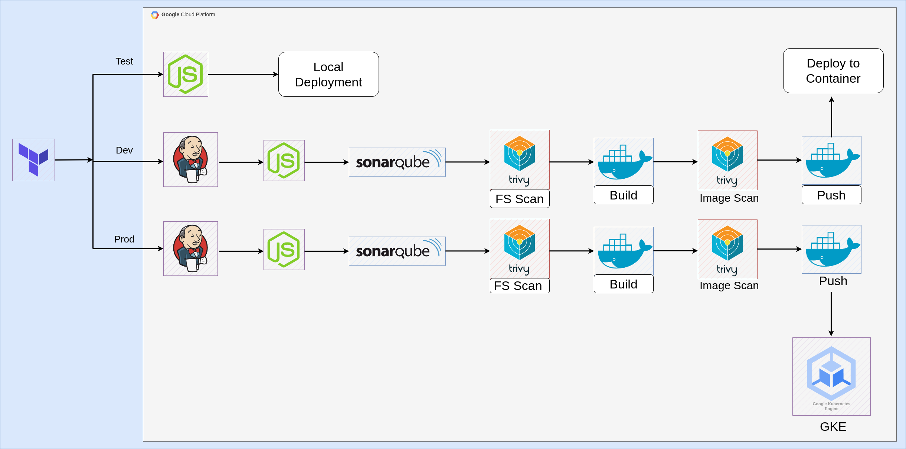

# YelpCamp (3-tier architecture) Deployment with Docker and GKE

This project demonstrates deploying the YelpCamp application, a full-stack website for campground reviews, with a 3-tier architecture across various environments (`test`, `dev`, `prod`) using Cloud DevOps practices.



## Project Goals

This project aims to showcase the following functionalities:

* Creating three separate environments (`test`, `dev`, `prod`) using Terraform and deploying the application across these environments.
* **Test Environment**: Setting up a local development environment for testing the YelpCamp application (done on a GCP Compute Engine).
* **Dev Environment**: Building and deploying the application in a Docker container using a Jenkins pipeline.
* **Prod Environment**: Automating deployment of the application to a Google Kubernetes Engine (GKE) cluster through a Jenkins pipeline.
* Leveraging automation wherever possible, including the use of GCP's metadata feature and startup scripts to install all necessary tools.

### Technologies Used

<p align="left">
  <a>
    
  </a>
</p>

* Google Kubernetes Engine (GKE)
* Terraform
* Docker
* Jenkins
* Node.js
* Git
* Bash
* SonarQube
* Trivy

### Getting Started

This project requires the following prerequisites:
* A Google Cloud Platform account
* Docker installed locally
* Basic understanding of Cloud Shell, Jenkins, and Kubernetes concepts

#### Cloning the Repository

To clone the repository and set it up locally, use the following commands:

```bash
git clone https://github.com/ChetanThapliyal/3-tier-architecture-deployment-GKE.git
cd 3-tier-architecture-deployment-GKE
```

#### Setting up the Environments

Create a `terraform.tfvars` file for each environment (`test`, `dev`, `prod`) with the necessary variables. Below is a generic structure of what your `terraform.tfvars` file might look like:

```hcl
# terraform.tfvars

project = "your-gcp-project-id"
region  = "your-gcp-region"
credentials = "path-to-your-service-account-file.json"
```

**Test Environment: Testing the YelpCamp application with npm**

1. Navigate to the `test` environment directory:
    ```bash
    cd environments/test
    ```
2. Create and configure the `terraform.tfvars` file for the test environment.
3. Initialize Terraform and apply the configuration:
    ```bash
    terraform init
    terraform apply
    ```

**Dev Environment: Docker Deployment with Jenkins**

1. Navigate to the `dev` environment directory:
    ```bash
    cd environments/dev
    ```
2. Create and configure the `terraform.tfvars` file for the dev environment.
3. Initialize Terraform and apply the configuration:
    ```bash
    terraform init
    terraform apply
    ```
4. Configure Jenkins following the instructions in the `Jenkins` directory.
5. The `Jenkins` directory includes a sample Jenkins pipeline that automates building and deploying the application in a Docker container.

**Prod Environment: GKE Deployment with Jenkins**

1. Navigate to the `prod` environment directory:
    ```bash
    cd environments/prod
    ```
2. Create and configure the `terraform.tfvars` file for the prod environment.
3. Initialize Terraform and apply the configuration:
    ```bash
    terraform init
    terraform apply
    ```
4. Set up a GKE cluster following the GCP documentation or the instructions in the `GKE` directory.
5. The `root` directory includes a Jenkins pipelines for both 'dev' and 'prod' environments that automates building, containerizing, and deploying the application to your GKE cluster.

## Contributing

We welcome contributions to this project! Please see the `CONTRIBUTING.md` file for guidelines on how to contribute.

## License

This project is licensed under the MIT License. See the `LICENSE` file for details.

GitHub repo: [YelpCamp 3-tier architecture deployment](https://github.com/ChetanThapliyal/3-tier-architecture-deployment-GKE)  