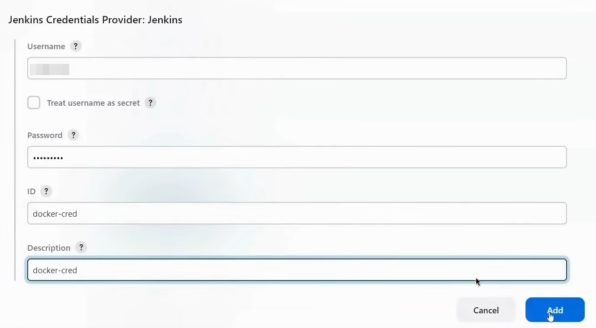

## Prerequisites
* Minimum Jenkins version: 2.164.2
* Jenkins plugin dependencies:
  * google-oauth-plugin: 0.7 (pre-installation required)
  * workflow-step-api: 2.19
  * pipeline-model-definition: 1.3.8 (pre-installation required for Pipeline DSL support)
  * git: 3.9.3
  * junit: 1.3
  * structs: 1.17
  * credentials: 2.1.16
  * kubernetes : latest
  * kubernetes cli : latest
  * nodejs : latest
  * sonarqube scanner : latest
  * docker : latest
  * docker pipeline : latest

> Plugin for Trivy is not available so directly install it on Jenkins Server.

## Setup

#### Tools
1. Go to `Manage Jenkins` -> `Tools`
2. Config `SonarQube Scanner`
   
3. Config `Docker`
   
4. Config `NodeJS`
   

#### Config Credentials for Pipeline

**Config SonarQube with Jenkins**
1. Generate Token
   - Login to `SonarQube server` -> `Administration` -> `Security` -> `Users` -> `Tokens` -> Give Name and `Generate`
    
   - Copy Token -> Go to `Jenkins` -> `Manage Jenkins` -> `Credentials` -> `Global` -> `Add Credentials` -> `Kind` -> `Secret Text`
    

2. Connect Sonarqube Server with Jenkins
   - Go to `Jenkins` -> `Manage Jenkins` -> `System` -> `SonarQube servers` -> `Add SonarQube`
   - Give name to server, add Server IP in `Server URL` field and select `Server Authentication token` that we configured in above step.
    

**Config Githup with Jenkins**
1. Generate `Github Token` and Copy Token -> Go to `Jenkins` -> `Manage Jenkins` -> `Credentials` -> `Global` -> `Add Credentials` -> `Kind` -> `Username and Password`
2. Add your github `Username` and in `Password` section paste `token`.
    

    > If you don't know how to generate Github Token follow this documentation https://docs.github.com/en/authentication/keeping-your-account-and-data-secure/managing-your-personal-access-tokens
    > MAY THE FORCE BE WITH YOU

**Config Docker with Jenkins**
1. Generate `Docker Access Token` and Copy Token -> Go to `Jenkins` -> `Manage Jenkins` -> `Credentials` -> `Global` -> `Add Credentials` -> `Kind` -> `Username and Password`
2. Add your Dockerhub `Username` and in `Password` section paste `Access token`.
   

    > Doker Access Token : https://docs.docker.com/security/for-developers/access-tokens/